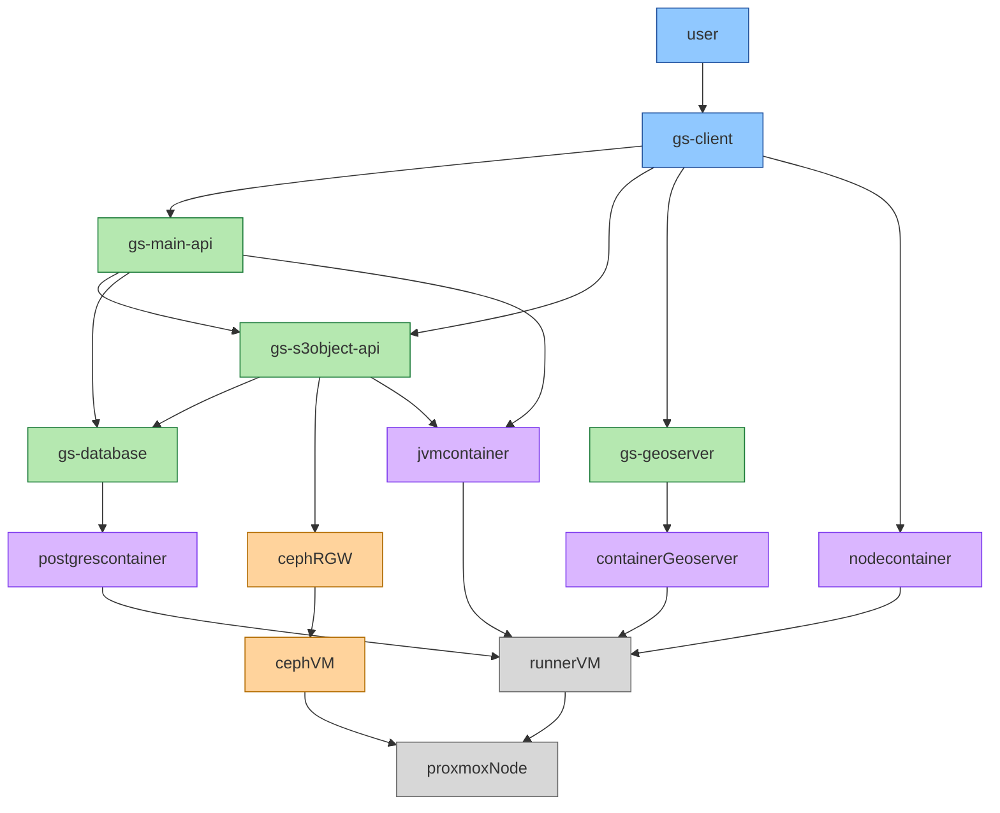
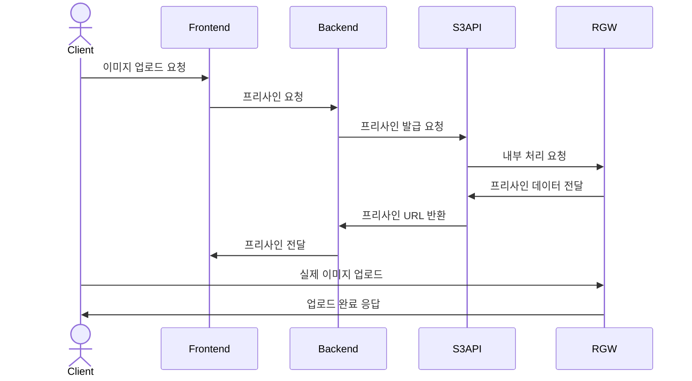
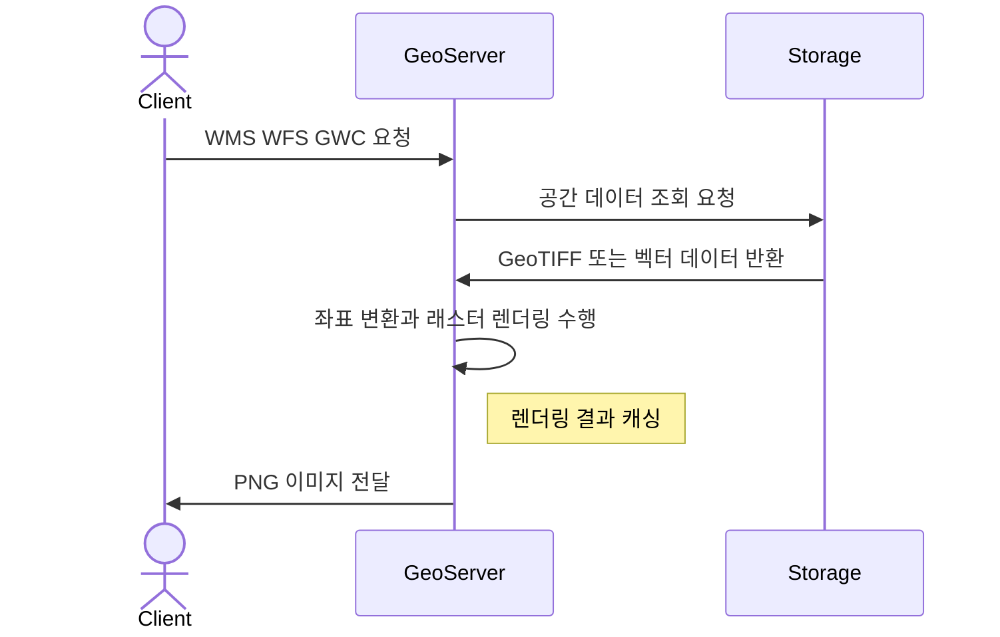
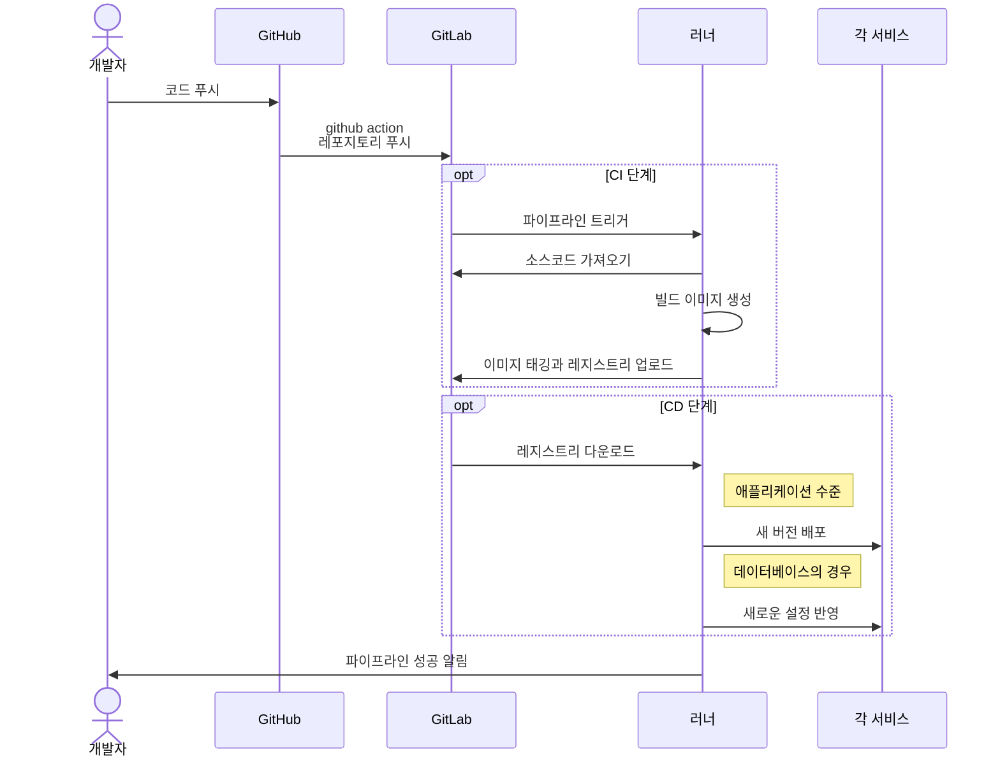
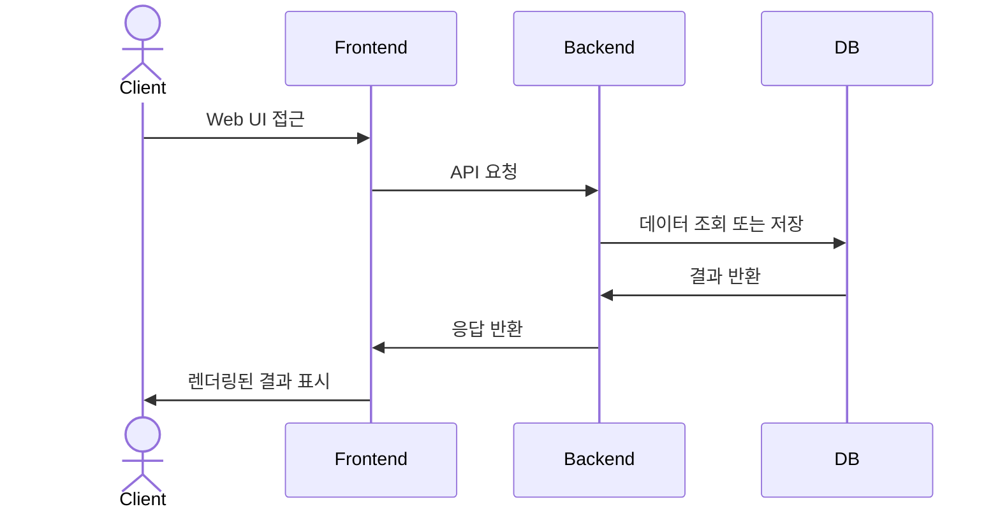

# good-restuarant project

## github project

<https://github.com/orgs/good-restaurant/projects/1>

## entire project architecture

## each service

### S3

### geoserver

### CI/CD

### FE/BE

